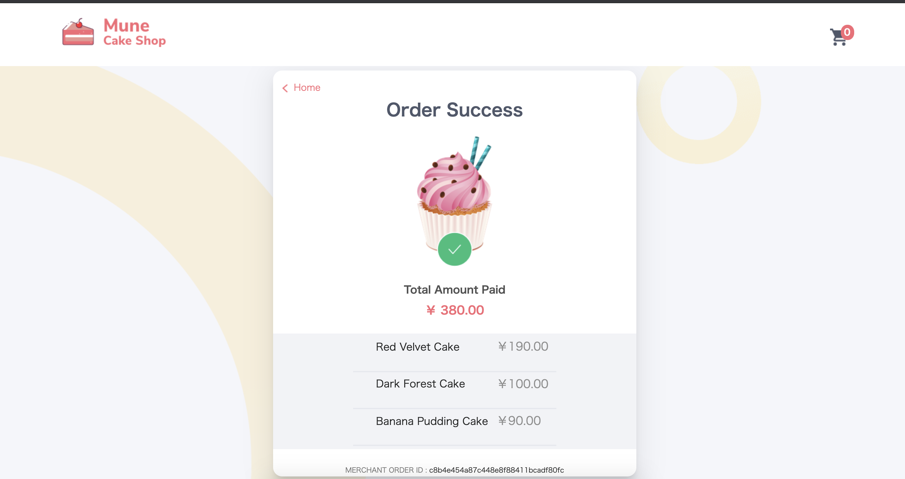

# PayPay Sample Web application


[](https://opensource.org/licenses/Apache-2.0)
[](https://app.fossa.com/projects/git%2Bgithub.com%2Fpaypay%2Fpaypay-sample-ecommerce?ref=badge_shield)
[](https://sonarcloud.io/dashboard?id=paypay_paypay-sample-ecommerce)


A simple and functional E-Commerce site developed in VueJS to demonstrate PayPay's different language SDK's implementations.

Key features:
  - VueJS with Vuex and route
  - Typescript class based components
  - CRUD operations on the cart
  - Polling functionality on order status check




# Client Installation
Install the dependencies and devDependencies and start the server.

```sh
$ cd client
$ yarn
$ yarn serve
```
You should now have the dev server running on http://localhost:8080

### Compiles and minifies for production
```
yarn build
```

### Lints and fixes files
```
yarn lint
```

# Server Installation

| SDK Language | README |
| ------ | ------ |
| Python | [Python SDK](server/python/README.md) |

License
----

Apache 2.0

### Cloud deployment

Additionally to trying out this application locally, you can deploy it to a variety of host services. Here is a small selection of them.

| [Zeit](https://zeit.co/)                        | [](https://zeit.co/new/project?template=https://github.com/paypay/paypay-sample-ecommerce/tree/master) |
| ----------------------------------------------- | ----------------------------------------------------------------------------------------------------------------------------------------------------- |
| [Heroku](https://www.heroku.com/deploy/?template=https://github.com/paypay/paypay-sample-ecommerce/tree/master) | [](https://www.heroku.com/deploy/?template=https://github.com/paypay/paypay-sample-ecommerce/tree/master)      |


License
=======

    Copyright 2020 PayPay

    Licensed under the Apache License, Version 2.0 (the "License");
    you may not use this file except in compliance with the License.
    You may obtain a copy of the License at

       http://www.apache.org/licenses/LICENSE-2.0

    Unless required by applicable law or agreed to in writing, software
    distributed under the License is distributed on an "AS IS" BASIS,
    WITHOUT WARRANTIES OR CONDITIONS OF ANY KIND, either express or implied.
    See the License for the specific language governing permissions and
    limitations under the License.


[](https://app.fossa.com/projects/git%2Bgithub.com%2Fpaypay%2Fpaypay-sample-ecommerce?ref=badge_large)
